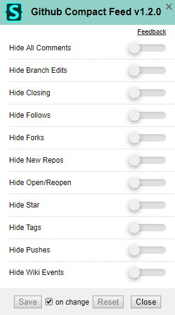

# GitHub Compact Feed 

A userstyle that compacts and hides details in the news feed.

Almost all details are hidden in the feed, except:

* New repos and repos made public.
* Pull request details.
* Wiki changes maintain a link to the diff.

## Preview

| Before | After |
|:------:|:-----:|
|  |  |

## Customization

In version 1.1.0+, visibility of feed may be dynamically set within the [Stylus](https://add0n.com/stylus.html)' [configuration popup](https://github.com/openstyles/stylus/wiki/Popup).

All feed entries are visible by default. And this customization is *not available* through installation from userstyles.org because you would need to go to that site each time you want to change the visibility of an item.

## Installation

A userstyle extension is required, common ones include:

🎨 Stylus for [Firefox](https://addons.mozilla.org/en-US/firefox/addon/styl-us/), [Chrome](https://chrome.google.com/webstore/detail/stylus/clngdbkpkpeebahjckkjfobafhncgmne) or [Opera](https://addons.opera.com/en-gb/extensions/details/stylus/). 
🎨 xStyle for [Firefox](https://addons.mozilla.org/firefox/addon/xstyle/) or [Chrome](https://chrome.google.com/webstore/detail/xstyle/hncgkmhphmncjohllpoleelnibpmccpj).

Then:

📦 [Install the usercss](https://github.com/StylishThemes/GitHub-Compact-Feed/raw/master/github-compact-feed.user.css) with Stylus or xStyle. Supports automatic updates.

## Contributions

If you would like to contribute to this repository, please...

1. 👓 Read the [contribution guidelines](CONTRIBUTING.md).
2.  [fork](https://github.com/StylishThemes/GitHub-Compact-Feed/fork) or 
[Download](https://github.com/StylishThemes/GitHub-Compact-Feed/archive/master.zip),
3. 👌 Create a pull request!

Thanks to all that have [contributed](AUTHORS) so far!
