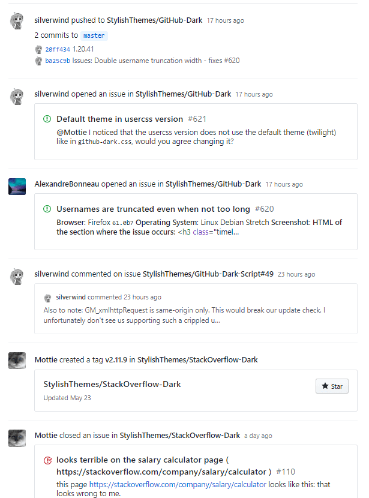
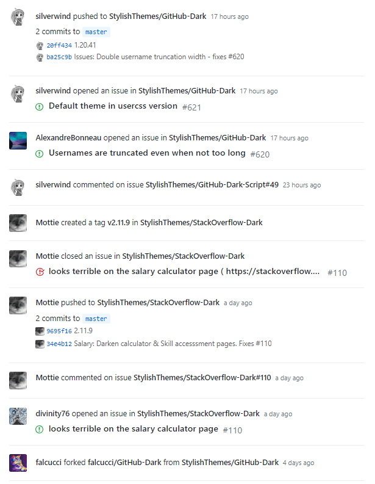

# GitHub Compact Feed 

A simple userstyle that compacts details in the news feed.

## Preview

| Before | After |
|:------:|:-----:|
|  |  |

## Installing

* If you're using a browser extension:
  * Stylus - get the addon for [Firefox](https://addons.mozilla.org/en-US/firefox/addon/styl-us/), [Chrome](https://chrome.google.com/webstore/detail/stylus/clngdbkpkpeebahjckkjfobafhncgmne) and [Opera](https://addons.opera.com/en-gb/extensions/details/stylus/).
  * Stylish - get the addon for [Firefox](https://addons.mozilla.org/en-US/firefox/addon/2108/), [Chrome](https://chrome.google.com/extensions/detail/fjnbnpbmkenffdnngjfgmeleoegfcffe), [Opera](https://addons.opera.com/en/extensions/details/stylish/), [Safari](http://sobolev.us/stylish/) and [Firefox Mobile](https://addons.mozilla.org/en-US/firefox/addon/2108/).
  * FreeStyler is available for [Chrome](https://chrome.google.com/webstore/detail/freestyler/hihigldmabkodfpehkgdemjklmaebmca). 
  * Then install this style using:
    * [userstyles.org](https://userstyles.org/styles/160435/github-compact-feed)
    * or, add it [manually](https://github.com/StylishThemes/GitHub-Compact-Feed/blob/master/github-compact-feed.user.css) into the editor.
* Or, **[install directly](https://raw.githubusercontent.com/StylishThemes/Github-Compact-Feed/master/github-compact-feed.user.css)** from this repository by opening the user.css file; only available using Stylus or FreeStyler (see the [documentation](https://github.com/openstyles/stylus/wiki/Usercss)). :tada:

## Updating

If a recent change broke the style, chances are that we already fixed it. Make sure to reinstall from [userstyles.org](https://userstyles.org/styles/160435/github-compact-feed) or [GitHub](https://github.com/StylishThemes/Github-Compact-Feed/raw/master/github-compact-feed.user.css) before opening an issue.

## Contributions

If you would like to contribute to this repository, please...

1. Fork
2. Make changes (please read the [contribution guidelines](./.github/CONTRIBUTING.md) and abide by them)
3. Create a pull request!
